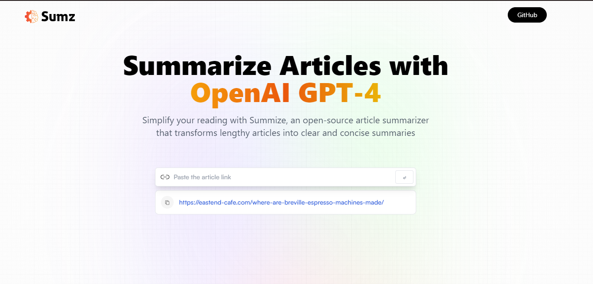

# Summize - Article Summarizer

Summize is an advanced open-source application that leverages the state-of-the-art OpenAI GPT-4 technology to provide efficient article summarization. It simplifies the reading experience by converting lengthy and complex articles into concise and clear summaries. Say goodbye to information overload and save valuable time with Summize.

## Features

- Cutting-edge summarization: Summize utilizes OpenAI GPT-4 to generate accurate and comprehensive summaries of articles.
- Simplified reading: Lengthy and complex articles are condensed into concise summaries, allowing for quick comprehension and efficient information extraction.
- Open-source and customizable: Summize's code is freely available on GitHub, enabling users to modify and adapt it according to their needs.
- User-friendly interface: The application provides a seamless and intuitive user interface for an enhanced user experience.
- Multi-platform support: Summize is compatible with various devices and platforms, ensuring accessibility for a wide range of users.

## Demo

You can explore a live demo of Summize [here](https://articlesummarizerpro.netlify.app/). Experience the power of article summarization firsthand and see how Summize simplifies your reading process.

## Installation

To run Summize locally, follow these steps:

1. Clone the repository: `git clone https://github.com/your-username/summize.git`
2. Navigate to the project directory: `cd summarize
3. Install the dependencies: `npm install`
4. Start the application: `npm start'
5. Access Summize in your browser at: `http://localhost:3000`

## Usage

1. Visit the Summize application in your browser.
2. Enter the URL or copy and paste the article content you wish to summarize.
3. Click the "Summarize" button.
4. After a few seconds, the generated summary will be displayed on the screen.

## Contributing

Contributions are welcome! If you'd like to contribute to Summize, please follow these steps:

1. Fork the repository.
2. Create a new branch: `git checkout -b my-feature`
3. Make your changes and commit them: `git commit -m 'Add new feature'`
4. Push to the branch: `git push origin my-feature`
5. Submit a pull request.

## License

Summize is licensed under the [MIT License](https://opensource.org/licenses/MIT).

## Acknowledgements

Summize was made possible by the incredible OpenAI GPT-4 model and the valuable contributions of the open-source community.

Thank you for using Summize!

